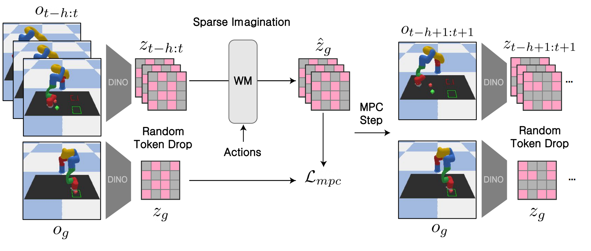

# Sparse Imagination for Efficient Visual World Model Planning
[[Paper]](https://arxiv.org/html/2506.01392v2) [[Project Page]](https://nikriz1.github.io/sparse_imagination/)

Junha Chun*, Youngjoon Jeong*, Taesup Kim†  
Seoul National University  
*Equal contribution, †Corresponding author*

Accepted to ICLR 2026 (Poster)



This repository contains the official minimal code release for Sparse Imagination for Efficient Visual World Model Planning. It is built on top of the original [DINO-WM repository](https://github.com/gaoyuezhou/dino_wm) and keeps only the training and planning paths used by the retained Sparse Imagination baselines.

# Getting Started

1. [Installation](#installation)
2. [Train a Sparse Imagination WM](#train-a-sparse-imagination-wm)
3. [Plan with a Sparse Imagination WM](#plan-with-a-sparse-imagination-wm)

## Installation

Create a fresh environment from the provided environment file:

```bash
conda env create -f environment.yaml -p /path/to/envs/sparse_imagination
conda activate /path/to/envs/sparse_imagination
```

The provided `environment.yaml` is based on the original DINO-WM setup and contains the dependencies required for this release.

Export the environment variables used by the canonical training and planning paths:

```bash
export DATASET_DIR=/path/to/data
export DINO_WM_RUN_DIR=/path/to/dino_wm_runs
export DINO_WM_CKPT_DIR=/path/to/checkpoints
export DINO_WM_PLAN_DIR=/path/to/plan_outputs
export WANDB_MODE=disabled
```

`DINO_WM_RUN_DIR` defaults to `./runs`, `DINO_WM_CKPT_DIR` defaults to `./runs/outputs`, and `DINO_WM_PLAN_DIR` defaults to `./plan_outputs` if unset.

The datasets used by this release can be obtained by following the download instructions in the original [DINO-WM repository](https://github.com/gaoyuezhou/dino_wm).

The code expects the dataset root to contain:

```text
$DATASET_DIR/
  point_maze/
  wall_single/
  pusht_noise/
  deformable/
    granular/
    rope/
```


### MuJoCo Notes

PointMaze uses Gym + MuJoCo. The Python dependency is installed through `environment.yaml`, but headless Linux machines often also need:

```bash
export MUJOCO_GL=egl
```

If `d4rl` import fails for PointMaze, install it separately:

```bash
pip install "cython<3"
pip install "git+https://github.com/Farama-Foundation/D4RL.git"
```

## Train a Sparse Imagination WM

Once you have completed the above steps, you can launch training with the canonical PointMaze random sparse setting below. Training outputs are written under `${DINO_WM_RUN_DIR:-./runs}/outputs/...`.

Example command for the random sparse baseline on PointMaze:

```bash
python train.py env=point_maze encoder=dinov1 predictor=vit_nope drop_rate_ub=0.5
```

Compared to the `full` baseline, `random` applies random patch-token dropout during training (`drop_rate_ub=0.5`), while `full` keeps all visual patch tokens (`drop_rate_ub=null`). Random sparse models use `predictor=vit_nope`, which removes patch-level positional embeddings so the predictor can operate on randomly selected visual token subsets. Full baselines should use `predictor=vit`.

## Plan with a Sparse Imagination WM

Once a world model has been trained, or checkpoint folders are available under `DINO_WM_CKPT_DIR`, you can run planning with the retained baselines. Planning assumes checkpoints are stored under `${DINO_WM_CKPT_DIR:-./runs/outputs}/<model_name>/checkpoints/model_latest.pth`.

PointMaze random sparse planning with `drop98`:

```bash
python plan.py \
  model_name=${MODEL_NAME} \
  planner=${PLANNER} \
  goal_H=${GOAL_H} \
  goal_source=random_state \
  n_evals=${N_EVALS} \
  seed=${SEED} \
  drop=true \
  plan_num_kept_patches=${PLAN_NUM_KEPT_PATCHES} \
  planner.max_iter=${PLANNER_MAX_ITER} \
```


Planning outputs are written under `${DINO_WM_PLAN_DIR:-./plan_outputs}`.

## Optional: PyFleX for Deformable Environments

Granular and rope planning require PyFleX. The public release does not bundle `PyFleX/`.

If you need the deformable environments, follow the PyFleX setup instructions from the original [DINO-WM repository](https://github.com/gaoyuezhou/dino_wm) and then export:

```bash
export PYFLEXROOT=/path/to/PyFleX
export PYTHONPATH=${PYFLEXROOT}/bindings/build:$PYTHONPATH
export LD_LIBRARY_PATH=${PYFLEXROOT}/external/SDL2-2.0.4/lib/x64:$LD_LIBRARY_PATH
```

PointMaze, Wall, and PushT do not require PyFleX.

## Citation

```bibtex
@article{chun2026sparseimagination,
  title   = {Sparse Imagination for Efficient Visual World Model Planning},
  author  = {Junha Chun and Youngjoon Jeong and Taesup Kim},
  journal = {ICLR},
  year    = {2026}
}
```

## Acknowledgement

This release is built on top of the original [DINO-WM repository](https://github.com/gaoyuezhou/dino_wm). We thank the authors for making their codebase available.
